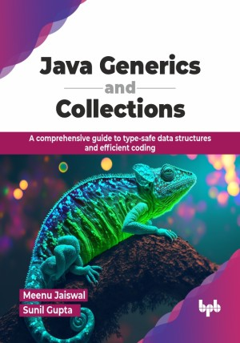

# Java Generics and Collections

A comprehensive guide to type-safe data structures and efficient coding.

This is the repository for [Java Generics and Collections
](https://bpbonline.com/products/java-generics-and-collections?variant=44838502858952),published by BPB Publications.

## About the Book
Java generics and the Collections Framework are at the heart of writing efficient, type-safe, and scalable Java applications. Generics are essential for type safety and maximizing code reusability, making your applications less prone to runtime errors. If you want to write code that is not only clean but also performs at its best, mastering these concepts is non-negotiable. This book is your go-to guide for unlocking the full potential of generics and collections, helping you write code that stands out.

This book systematically breaks down the entire subject, beginning with generic classes and methods before exploring advanced bounded types and wildcards. You will explore key Java collections like Sets, Lists, Queues, and Maps by learning the best use cases and implementation techniques for each. You will also tackle thread safety, performance optimization, and extending collections to solve real-world problems efficiently. Furthermore, you will learn about Queue and Deque structures, synchronization techniques, utility classes for sorting and searching, and applying generic algorithms. 

By the end of this book, you will be more than just a proficient Java developer; you will be a master of generics and collections. Whether you are optimizing applications, designing robust data structures, or ensuring thread-safe environments, you’ll have the skills to build fast, efficient, and maintainable code with confidence.

## What You Will Learn
• Apply generics for type safety in classes, methods, and constructors.

• Work with Java collections like Lists, Maps, and Queues.

• Explore wildcards, subtyping, and bounded types in generics.

• Learn to optimize performance and ensure thread safety.

• Extend and customize collections for real-world use cases.

• Navigate the collections hierarchy using iterable, collection, and wrapper classes.
